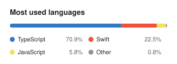

# Hey there! 

I'm Marton, a **senior full-stack developer** and a proud **vibe coder** 🤖, Brazilian and living in Spain.

I've been shipping for the web since 2019: React, Next.js and TypeScript up front, Node.js, Java and Spring Boot behind the API. These days most of my code is written by AI agents I direct. I describe the change, they draft it, and I review, test and ship it. The craft didn't go away, it moved to the guardrails. 🛡️

I didn't choose front-end... front-end chose me! 🎯 Pixel perfection and accessibility are still where I care most, and lately that includes native apps for the Mac and iPhone in Swift.

I have a degree in Systems Analysis and Development and a specialization in Full Stack Development from PUC Minas 🇧🇷

### What I'm building

- 🪟 [WindowHop](https://windowhop.martonpaulo.com), [Mailbell](https://mailbell.martonpaulo.com) and [Meantime](https://meantime.martonpaulo.com): native macOS utilities for the menu bar
- 🧮 [Tabelo](https://tabelo.martonpaulo.com), [Issues Graph](https://issues.martonpaulo.com) and [AtlasTint](https://atlastint.martonpaulo.com): browser tools that keep your data on your machine
- 🔤 [Moon Uniform](https://moon.martonpaulo.com): an open typeface for the Moon tactile alphabet

Everything else is at [martonpaulo.com](https://martonpaulo.com).

### Off the keyboard

- Languages and cultures 🗣️: I speak Portuguese, English, Spanish and Esperanto, and I've studied Chinese, French, Russian and Libras
- Anything uncommon enough to make me curious 🔭
- Tinkering with my tools: Hammerspoon, Raycast and a Mac that automates itself ⚙️

### Stack

<picture>
  <source media="(prefers-color-scheme: dark)" srcset="assets/languages-dark.svg">
  
</picture>
